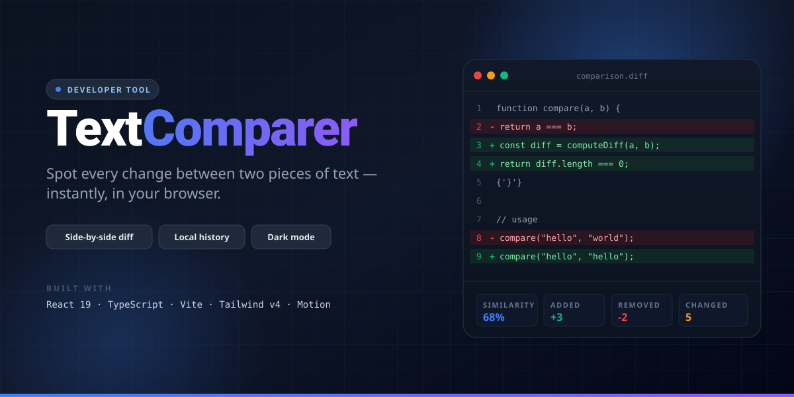

<div align="center">



# TextComparer

**A modern, professional text comparison tool for developers.**
Side-by-side diffing, history tracking, statistics, and a polished light/dark UI.

</div>

---

## Overview

TextComparer is a fast, fully client-side diffing app built with **React 19**, **TypeScript**, **Vite**, and **Tailwind CSS v4**. It helps developers and writers spot changes between two pieces of text instantly — with line-level precision, smooth motion, and a UI tuned for long sessions.

## Features

- **Precision diffing** — line-by-line comparison powered by the `diff` engine, highlighting additions, removals, and modifications.
- **At-a-glance stats** — similarity percentage, additions, removals, and changes summarized in animated cards.
- **History** — every comparison is stored locally so you can revisit, reload, or delete past diffs.
- **Performance insights** — a Statistics page aggregates your diff activity over time.
- **Light & dark mode** — system-aware theme with manual override.
- **Keyboard shortcuts** — `⌘/Ctrl + Enter` to compare, `⌘/Ctrl + L` to clear, `Esc` to exit a diff view.
- **Responsive layout** — works on desktop, tablet, and mobile, with a floating action button on small screens.
- **Smooth motion** — page transitions and component animations powered by Motion (Framer Motion v12).
- **Zero backend** — everything runs in the browser; nothing is uploaded.

## Tech Stack

| Area              | Tools                                       |
| ----------------- | ------------------------------------------- |
| Framework         | React 19, React Router v7 (HashRouter)      |
| Language          | TypeScript 5.8                              |
| Build             | Vite 6                                      |
| Styling           | Tailwind CSS v4, `clsx`, `tailwind-merge`   |
| Animation         | Motion (Framer Motion v12)                  |
| Icons             | lucide-react                                |
| Diffing           | `diff`                                      |
| Deployment        | GitHub Pages (`gh-pages`)                   |

## Getting Started

### Prerequisites

- Node.js 18+

### Installation

```bash
git clone https://github.com/YuraTadevosyan/text-comparer.git
cd text-comparer
npm install
```

### Run locally

```bash
npm run dev
```

The app starts at [http://localhost:5173](http://localhost:5173).

### Build for production

```bash
npm run build
npm run preview
```

### Deploy to GitHub Pages

```bash
npm run deploy
```

## Project Structure

```
src/
├── components/      # Layout, Header, Sidebar, DiffViewer, TextPanel, …
├── pages/           # Compare, History, Statistics, API
├── lib/             # Shortcuts, utilities
├── utils/           # Diff engine
├── types/           # Shared TypeScript types
└── App.tsx          # Router and theme provider
```

## Keyboard Shortcuts

| Action          | Shortcut          |
| --------------- | ----------------- |
| Compare texts   | `⌘/Ctrl + Enter`  |
| Clear inputs    | `⌘/Ctrl + L`      |
| Exit diff view  | `Esc`             |

## Author

**Yura Tadevosyan**
[GitHub](https://github.com/YuraTadevosyan) · yuratadevosyan01@gmail.com

## License

Apache-2.0
